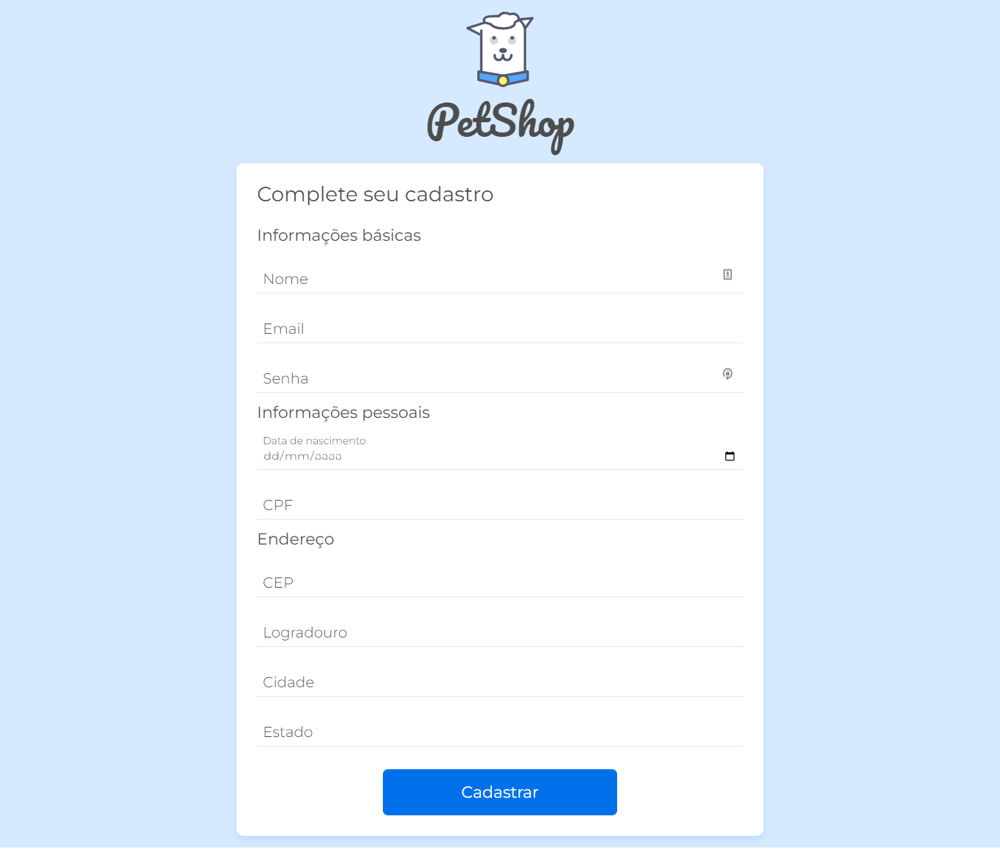
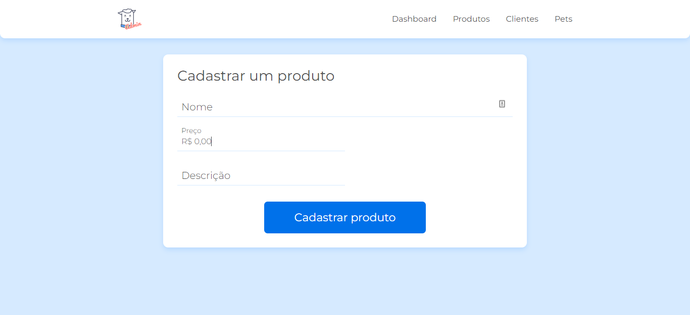

# validacao-doguito

Projeto criado durante o curso JavaScript na Web: validação de Formulários e HTML5, da Alura, dentro da [formaçao Front-end](https://cursos.alura.com.br/formacao-front-end).

Você pode ver o resultado final [aqui](https://jessicalorenzon.github.io/validacao-doguito).

